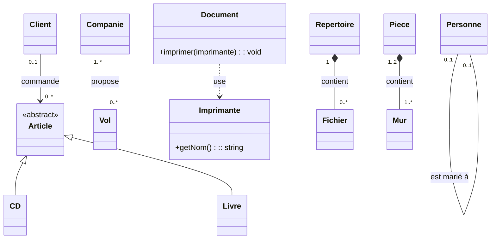

# TP_3_R302_303

##Exercice 1

### 1.1

```mermaid
classDiagram
    Article <|-- CD
    Article <|-- Livre

    class Client{

    }

    class Article{
    <<abstract>>

    }
    class CD{
    }

    class Livre {

    }

    Client "0..1" --> "0..*" Article : commande


    class Companie {

    }

    class Vol {

    }

    Companie "1..*" -- "0..*" Vol : propose

    class Personne {

    }

    Personne "0..1" -- "0..1" Personne : est marié à


    class Document {
        +imprimer(imprimante) : void
    }

    class Imprimante {
        +getNom() :: string
    }

    Document ..> Imprimante : use


    class Repertoire {

    }

    class Fichier {

    }

    Repertoire "1" *-- "0..*" Fichier : contient


    class Piece {

    }

    class Mur {

    }

    Piece "1..2" *-- "1..*" Mur : contient

```